# NeuGraph System Architecture and Workflows

This document provides a comprehensive overview of the NeuGraph system architecture, detailing the components, their interactions, and the end-to-end workflows for data processing, analysis, and user interaction.

## 1. Unified System Architecture

This diagram illustrates the multi-layered architecture of the NeuGraph platform, from data ingestion to the user-facing application.

### 2.2. AI-Powered Query Workflow

This sequence shows how a user's natural language query is processed by the system to return a governed, contextualized answer.

```mermaid
sequenceDiagram
    participant U as 👤 User
    participant UI as 🖥️ NeuGraph UI
    participant API as 🔌 FastAPI Backend
    participant GOV as 🛡️ Governance Engine
    participant AI as 🤖 AWS Bedrock (Llama 3.1)
    participant DB as 🏛️ AWS Neptune

    U->>UI: "Find genes related to Alzheimer's"
    UI->>API: Send query + user context
    API->>GOV: 1. Check user permissions
    GOV-->>API: User clearance level (e.g., INTERNAL)
    API->>AI: 2. Generate graph query from NL
    AI-->>API: Cypher/Gremlin query: "MATCH (g:Gene)-[:ASSOCIATED_WITH]->(d:Disease {name:'Alzheimer\'s'}) RETURN g"
    API->>GOV: 3. Apply access filters to query
    GOV-->>API: Filtered query (adds data classification checks)
    API->>DB: 4. Execute filtered query
    DB-->>API: Raw graph results
    API->>GOV: 5. Filter results by classification
    GOV-->>API: Authorized results (e.g., only PUBLIC, INTERNAL data)
    API->>AI: 6. Generate natural language explanation
    AI-->>API: "Results..."
    API-->>UI: 7. Display response with governance notes
```

### 2.3. UI Interaction Flow

This diagram outlines the primary navigation paths and interactions within the NeuGraph user interface.

```mermaid
flowchart LR
    subgraph "User Interaction Flow"
        A["👤 User Login"] --> B["🛡️ Authentication"]
        B --> C["📊 Dashboard"]

        C --> D["🕸️ Graph Explorer"]
        C --> E["🤖 AI Assistant"]
        C --> F["🛡️ Governance Panel"]

        D --> G["🎨 Visual Graph Exploration"]
        E --> H["💬 Natural Language Queries"]
        F --> I["👥 Access Control Management"]

        G --> J["📄 Node Details & Lineage"]
        H --> K["🔍 AI-Generated Results"]
        I --> L["📋 Compliance Reports & Audits"]
    end

    subgraph "Backend Services"
        P["🏛️ Graph Database"]
        Q["🤖 AI Engine"]
        R["🛡️ Governance Service"]

        G --> P
        H --> Q
        I --> R
    end
```

## 3. Advanced Technical Capabilities

### 3.1. Real-Time Data Processing

NeuGraph supports real-time data ingestion and processing through Apache Kafka streaming architecture.

---

### Explanation

- **Data Sources:** Both external (literature, trials, regulatory) and internal (operational, warehouse, images).
- **Data Mesh & Connectors:** Data is accessed in place via APIs or ETL, indexed and enriched with metadata.
- **Semantic Layer:** Ontologies and a knowledge graph provide structure, context, and validation (SHACL). Metadata repository links everything.
- **AI/LLM Layer:** Semantic search and LLMs work together (RAG) to answer questions, generate content, and provide context-aware results. Human-in-the-loop ensures quality and curation.
- **User & Analytics:** Users interact through search UIs, dashboards, document generation, and collaboration tools. Full traceability and provenance are provided for every answer or document.
- **Feedback Loops:** User feedback and curation update the ontology/knowledge graph and improve the system iteratively.

---