# NeuGraph Data Governance Framework

This document outlines the data governance model for the NeuGraph platform, including data classification, user roles, access control policies, and compliance measures.

## 1. Data Classification

Data within NeuGraph is categorized into four sensitivity levels. This classification determines the access controls and handling procedures for all data assets.

```mermaid
graph LR
    subgraph "Data Classification Levels"
        A["<font color=green>🟢 PUBLIC</font><br/>Open-source, non-sensitive data.<br/>*Example: Public gene annotations, academic papers.*"]
        B["<font color=blue>🟡 INTERNAL</font><br/>For internal use, low sensitivity.<br/>*Example: Internal research notes, experimental designs.*"]
        C["<font color=orange>🟠 CONFIDENTIAL</font><br/>Proprietary or sensitive business data.<br/>*Example: Pre-patent drug compounds, strategic plans.*"]
        D["<font color=red>🔴 RESTRICTED</font><br/>Highly sensitive, regulated data.<br/>*Example: Patient clinical trial data, personally identifiable information PII.*"]
    end
```

## 2. User Roles and Access Matrix

User roles are defined based on job function and their required level of data access. The matrix below maps roles to the data classification levels they are permitted to access.

```mermaid
graph TB
    subgraph "User Roles"
        R1["👨‍🔬 Researcher"]
        R2["👨‍💼 Principal Investigator"]
        R3["🛡️ Data Steward"]
        R4["📋 Compliance Officer"]
        R5["👑 System Admin"]
    end

    subgraph "Data Access Permissions"
        L1["🟢 PUBLIC"]
        L2["🟡 INTERNAL"]
        L3["🟠 CONFIDENTIAL"]
        L4["🔴 RESTRICTED"]
    end

    R1 --> L1 & L2
    R2 --> L1 & L2 & L3
    R3 --> L1 & L2 & L3 & L4
    R4 --> L1 & L2 & L3 & L4
    R5 --> L1 & L2 & L3 & L4

    subgraph "Actions"
        A1["Read"]
        A2["Write"]
        A3["Delete"]
        A4["Govern"]
    end

    R1 -- "Read/Write" --> L1
    R1 -- "Read" --> L2

    R2 -- "Read/Write" --> L1 & L2
    R2 -- "Read" --> L3

    R3 -- "Govern" --> A4
    R4 -- "Read-Only Audit" --> L1 & L2 & L3 & L4
    R5 -- "Full Control" --> A1 & A2 & A3 & A4
```

## 3. Compliance and Auditing

NeuGraph is designed to support compliance with regulations like **HIPAA** and **GDPR**.

- **Audit Trails**: All data access, queries, and modifications are logged for auditing purposes.
- **Data Lineage**: The platform provides tools to trace data from its source to its use in analysis, ensuring transparency.
- **Access Reviews**: Automated workflows trigger periodic reviews of user access rights by Data Stewards.

