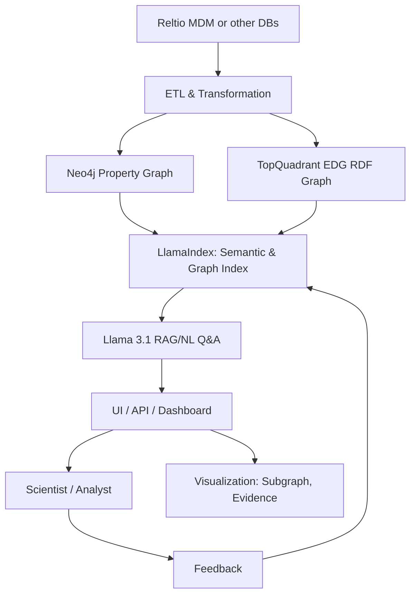
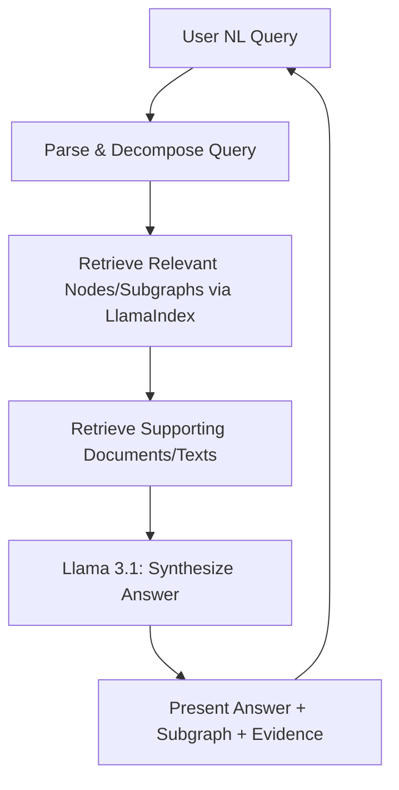

# **NeuGraph: Semantic Discovery Layer for Scientific Knowledge**

For a detailed breakdown of NeuGraph's technical workflow and architecture—including data curation, ETL, graph construction, semantic indexing, and AI-powered reasoning—see [`architecture.md`](architecture.md).

For comprehensive data governance, user roles, and compliance information, see [`governance.md`](governance.md).

This document focuses on the platform vision, user value, and high-level use cases. Technical readers and implementers should refer to the architecture and governance documentation for in-depth system details.er for Scientific Knowledge**

## **Overview**

**NeuGraph** is an AI-powered semantic discovery platform that sits atop a governed data graph, enabling scientists to ask complex, domain-specific questions and receive evidence-backed, explainable answers. It combines enterprise-grade data curation (Reltio), flexible graph modeling (Neo4j or TopQuadrant EDG), and advanced retrieval-augmented generation (RAG) using Llama 3.1 or later and LlamaIndex.

---

## **Key Capabilities**

- **Semantic Q&A:** Go beyond keyword search—ask nuanced questions about genes, traits, compounds, and evidence.
- **Knowledge Graph Backbone:** Integrate and structure data from Reltio MDM, public databases, and literature into a queryable graph.
- **RAG Layer with Llama 3.1:** Retrieve relevant graph nodes and supporting documents, then synthesize human-readable explanations.
- **Explainable Insights:** Answers are always grounded in graph data, with references to literature, experiments, and metadata.
- **Scalable & Private:** Built for enterprise use—modular, secure, and customizable.

---


## **End-to-End Workflow (Summary)**

For a detailed breakdown of NeuGraph’s technical workflow and architecture—including data curation, ETL, graph construction, semantic indexing, and AI-powered reasoning—see [`architecture.md`](neuGraph_workflow_architecture.md).

This document focuses on the platform vision, user value, and high-level use cases. Technical readers and implementers should refer to the architecture documentation for in-depth system details.

---

## **Architecture Diagrams (Mermaid)**

### **A. High-Level System Architecture**



---

### **B. Semantic Discovery Query Workflow**



---

## **Technology Stack**

| Layer             | Recommended Tools/Tech            |
|-------------------|-----------------------------------|
| Data Governance   | MDM tool                          |
| ETL/Integration   | Python, Airflow, APIs             |
| Knowledge Graph   | Neo4j, TopQuadrant EDG            |
| Semantic Indexing | LlamaIndex                        |
| Embeddings/RAG    | Llama 3.1                         |
| UI/API            | Streamlit, Dash, FastAPI          |

---

## **Prototype Implementation Roadmap**

| Week | Milestone                                           |
|------|-----------------------------------------------------|
| 1    | Define use case    |
| 2    | ETL from Reltio to Neo4j/EDG (sample data)          |
| 3    | Build graph schema and ingest data                  |
| 4    | Set up LlamaIndex semantic index                    |
| 5    | Integrate Llama 3.1 for RAG/NL Q&A                  |
| 6    | Develop UI/API for querying and visualization       |
| 7    | Internal demo, collect feedback                     |
| 8    | Iterate and expand                                  |


** Prototype Implementation Checklist **

### **1. Define Scope & Use Case**
- [ ] Identify specific crop, trait, and biological focus
- [ ] List core questions the prototype should answer (e.g., genes ↔ traits, compounds, evidence)

---

### **2. Data Preparation**
- [ ] Inventory and access  MDM data (Reltio or similar)
- [ ] Identify relevant entities
- [ ] Select a manageable sample dataset for the MVP
- [ ] Map Reltio fields/entities to your knowledge graph schema

---

### **3. ETL & Graph Construction**
- [ ] Develop ETL scripts to extract relevant entities and relationships from Reltio
- [ ] Transform data into graph format (nodes/edges, properties, relationships)
- [ ] Ingest data into Neo4j or TopQuadrant EDG
- [ ] Validate graph structure (e.g., (Gene)-[:ASSOCIATED_WITH]->(Trait), etc.)

---

### **4. Semantic Indexing & RAG Setup**
- [ ] Install and configure LlamaIndex
- [ ] Build semantic and graph-based indexes over your Neo4j/EDG data
- [ ] Generate embeddings for nodes/edges (using Llama 3.1 or similar)
- [ ] Chunk and embed supporting literature/experiment text (if available)

---

### **5. Query & Reasoning Layer**
- [ ] Integrate Llama 3.1 with LlamaIndex for RAG-based NL Q&A
- [ ] Develop prompt templates that ground answers in graph context
- [ ] Test queries 

---

### **6. User Interface / API**
- [ ] Build a simple UI (Streamlit, Dash, or Jupyter) or API endpoint
- [ ] Allow users to submit NL queries and view answers
- [ ] Display supporting subgraphs and evidence (visualization, e.g., Neo4j Bloom or Cytoscape)
- [ ] Provide citation links or references in answers

---

### **7. Feedback & Iteration**
- [ ] Collect feedback from at least 2–3 scientists or users
- [ ] Log queries, answers, and user feedback for improvement
- [ ] Refine data mapping, prompts, and retrieval logic based on feedback

---

### **8. Documentation**
- [ ] Document your graph schema and data sources
- [ ] Document ETL, indexing, and RAG pipeline steps
- [ ] Write a short “How to use” guide for testers

---

### **9. Security & Compliance**
- [ ] Ensure access control for sensitive data (password, SSO, etc.)
- [ ] Log user access and actions for auditing

---

### **10. Demo & Next Steps**
- [ ] Prepare a short demo (live or screenshots) for stakeholders
- [ ] Summarize key results and scientist feedback
- [ ] Propose next steps: expanding data, improving analytics, scaling up, or integrating with enterprise systems

---

# **ETL Script for Reltio → Knowledge Graph (Neo4j Example)**

### **Assumptions**
- You have Reltio API access (API key, tenant URL, etc.).
- You want to extract entities (e.g., Genes, Traits, Compounds) and relationships (e.g., ASSOCIATED_WITH, MODULATED_BY).
- You want to load the data into Neo4j using the `py2neo` library.

---

## **1. Install Required Libraries**

```bash
pip install requests py2neo
```

---

## **2. Set Up Reltio API Access**

```python
import requests

RELTIO_API_URL = "https://{tenant}.reltio.com/reltio/api/{tenant_id}/entities"
RELTIO_API_KEY = "YOUR_API_KEY"
RELTIO_HEADERS = {
    "Authorization": f"Bearer {RELTIO_API_KEY}",
    "Content-Type": "application/json"
}
```

---

## **3. Extract Data from Reltio**

```python
def get_entities(entity_type, limit=1000):
    params = {
        "filter": f"type=={entity_type}",
        "max": limit
    }
    response = requests.get(RELTIO_API_URL, headers=RELTIO_HEADERS, params=params)
    response.raise_for_status()
    data = response.json()
    return data.get("entities", [])

# Example: Get all Genes, Traits, Compounds
genes = get_entities("Gene")
traits = get_entities("Trait")
compounds = get_entities("Compound")
```

---

## **4. Extract Relationships (if modeled as crosswalks or links in Reltio)**

```python
def extract_relationships(entities, rel_property, from_type, to_type):
    relationships = []
    for entity in entities:
        source_id = entity['uri']
        for rel in entity.get('properties', {}).get(rel_property, []):
            target_id = rel.get('targetUri')
            if target_id:
                relationships.append((from_type, source_id, rel_property, to_type, target_id))
    return relationships

# Example: Extract associations between Genes and Traits
gene_trait_relationships = extract_relationships(genes, "associatedWith", "Gene", "Trait")
```

---

## **5. Transform Data for Neo4j**

```python
from py2neo import Graph, Node, Relationship

graph = Graph("bolt://localhost:7687", auth=("neo4j", "password"))

def upsert_node(label, properties):
    node = Node(label, **properties)
    graph.merge(node, label, "id")  # Use "id" as unique property

def upsert_relationship(from_label, from_id, rel_type, to_label, to_id):
    tx = graph.begin()
    from_node = graph.nodes.match(from_label, id=from_id).first()
    to_node = graph.nodes.match(to_label, id=to_id).first()
    if from_node and to_node:
        rel = Relationship(from_node, rel_type, to_node)
        tx.merge(rel)
        tx.commit()

# Upsert nodes
for gene in genes:
    upsert_node("Gene", {"id": gene['uri'], "name": gene['properties'].get('name')})

for trait in traits:
    upsert_node("Trait", {"id": trait['uri'], "name": trait['properties'].get('name')})

for compound in compounds:
    upsert_node("Compound", {"id": compound['uri'], "name": compound['properties'].get('name')})

# Upsert relationships
for rel in gene_trait_relationships:
    from_label, from_id, rel_type, to_label, to_id = rel
    upsert_relationship(from_label, from_id, rel_type.upper(), to_label, to_id)
```

---

## **6. (Optional) Enrich with Literature or Experiment Evidence**

You can extend the script to extract and load Publications or Experiments and link them to genes/traits/compounds as additional nodes and relationships.

---

## **7. Schedule & Automate**

- Consider running this ETL script as a scheduled job (using cron, Airflow, etc.) to keep your graph in sync with Reltio.
- Add logging and error handling for production use.

---

## **Customization Tips**
- Adjust entity types and relationship names to match your Reltio schema.
- For TopQuadrant EDG, adapt the loading part to use RDF libraries like `rdflib` instead of `py2neo`.
- You can add more node/edge properties as needed.

---


# **sample Airflow DAG** to orchestrate the ETL process from Reltio to Neo4j. 

This DAG will:

- Extract entities and relationships from Reltio
- Transform the data
- Load data into Neo4j

You can expand this pattern for other entity types, more complex relationships, or for TopQuadrant EDG.

---

## **1. Prerequisites**

- Install Airflow and dependencies:
  ```bash
  pip install apache-airflow requests py2neo
  ```
- Place your ETL functions in a Python module (e.g., `reltio_etl_utils.py`) or directly in the DAG file for prototyping.

---

## **2. Airflow DAG Script**

```python
from datetime import datetime, timedelta
from airflow import DAG
from airflow.operators.python import PythonOperator

import requests
from py2neo import Graph, Node, Relationship

# ---- CONFIG ----
RELTIO_API_URL = "https://{tenant}.reltio.com/reltio/api/{tenant_id}/entities"
RELTIO_API_KEY = "YOUR_API_KEY"
RELTIO_HEADERS = {
    "Authorization": f"Bearer {RELTIO_API_KEY}",
    "Content-Type": "application/json"
}
NEO4J_URL = "bolt://localhost:7687"
NEO4J_USER = "neo4j"
NEO4J_PASS = "password"

# ---- ETL FUNCTIONS ----
def extract_entities(entity_type, limit=1000, **kwargs):
    params = {
        "filter": f"type=={entity_type}",
        "max": limit
    }
    response = requests.get(RELTIO_API_URL, headers=RELTIO_HEADERS, params=params)
    response.raise_for_status()
    data = response.json()
    # Save to XCom (Airflow's cross-task communication)
    kwargs['ti'].xcom_push(key=f"{entity_type.lower()}_entities", value=data.get("entities", []))

def extract_relationships(**kwargs):
    genes = kwargs['ti'].xcom_pull(key="gene_entities", task_ids="extract_genes")
    relationships = []
    for gene in genes:
        source_id = gene['uri']
        for rel in gene.get('properties', {}).get('associatedWith', []):
            target_id = rel.get('targetUri')
            if target_id:
                relationships.append(("Gene", source_id, "ASSOCIATED_WITH", "Trait", target_id))
    kwargs['ti'].xcom_push(key="gene_trait_relationships", value=relationships)

def load_to_neo4j(**kwargs):
    graph = Graph(NEO4J_URL, auth=(NEO4J_USER, NEO4J_PASS))
    genes = kwargs['ti'].xcom_pull(key="gene_entities", task_ids="extract_genes")
    traits = kwargs['ti'].xcom_pull(key="trait_entities", task_ids="extract_traits")
    relationships = kwargs['ti'].xcom_pull(key="gene_trait_relationships", task_ids="extract_relationships")
    
    # Upsert nodes
    for gene in genes:
        node = Node("Gene", id=gene['uri'], name=gene['properties'].get('name'))
        graph.merge(node, "Gene", "id")
    for trait in traits:
        node = Node("Trait", id=trait['uri'], name=trait['properties'].get('name'))
        graph.merge(node, "Trait", "id")
    # Upsert relationships
    for from_label, from_id, rel_type, to_label, to_id in relationships:
        tx = graph.begin()
        from_node = graph.nodes.match(from_label, id=from_id).first()
        to_node = graph.nodes.match(to_label, id=to_id).first()
        if from_node and to_node:
            rel = Relationship(from_node, rel_type, to_node)
            tx.merge(rel)
            tx.commit()

# ---- AIRFLOW DAG ----
default_args = {
    'owner': 'airflow',
    'depends_on_past': False,
    'start_date': datetime(2024, 1, 1),
    'retries': 1,
    'retry_delay': timedelta(minutes=5),
}

with DAG(
    'reltio_to_neo4j_etl',
    default_args=default_args,
    schedule_interval='@daily',
    catchup=False,
    tags=['reltio', 'neo4j', 'etl'],
) as dag:

    extract_genes = PythonOperator(
        task_id='extract_genes',
        python_callable=extract_entities,
        op_kwargs={'entity_type': 'Gene'},
        provide_context=True,
    )

    extract_traits = PythonOperator(
        task_id='extract_traits',
        python_callable=extract_entities,
        op_kwargs={'entity_type': 'Trait'},
        provide_context=True,
    )

    extract_relationships_task = PythonOperator(
        task_id='extract_relationships',
        python_callable=extract_relationships,
        provide_context=True,
    )

    load_to_neo4j_task = PythonOperator(
        task_id='load_to_neo4j',
        python_callable=load_to_neo4j,
        provide_context=True,
    )

    # DAG dependencies
    [extract_genes, extract_traits] >> extract_relationships_task >> load_to_neo4j_task
```

---

## **How it works**

1. **extract_genes** and **extract_traits**: Pull entities from Reltio and store in XCom.
2. **extract_relationships**: Builds a list of relationships based on the extracted entities.
3. **load_to_neo4j**: Loads entities and relationships into Neo4j.

---

## **Customizations**
- Expand for more entity types (e.g., Compounds, Experiments).
- Add error handling, logging, and notifications.
- Adapt for TopQuadrant EDG by swapping the load step to use RDF libraries.

---


## **Extracting nodes and edges from published articles to build a knowledge graph**
...

---
## **Data Governance & Quality**

### 1. Automated Data Quality Checks
```python
# Example: Data quality pipeline
class BiologicalDataValidator:
    def validate_gene_data(self, gene_entity):
        checks = [
            self.validate_gene_symbol_format(gene_entity['symbol']),
            self.validate_chromosome_location(gene_entity['location']),
            self.cross_reference_uniprot(gene_entity['protein_id'])
        ]
        return all(checks)
```

### 2. Provenance Tracking
- Track data lineage from source to final insights
- Version control for graph schema evolution
- Audit trails for all data transformations

### 3. Bias Detection & Fairness
- Detect and mitigate biases in biological datasets
- Ensure representation across different populations/species
- Implement fairness metrics for AI recommendations